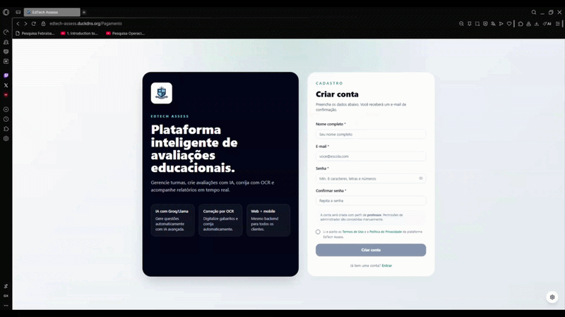
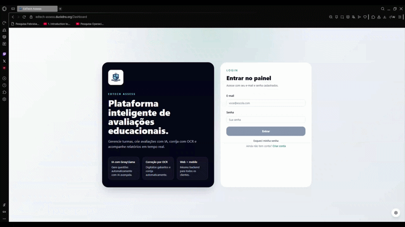
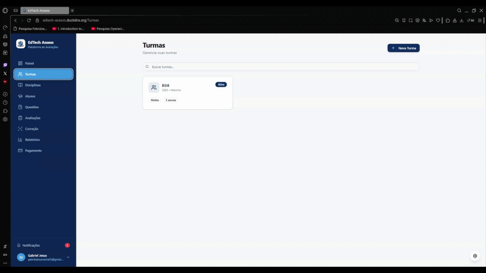
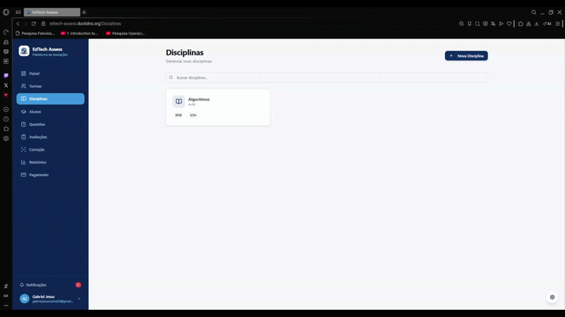
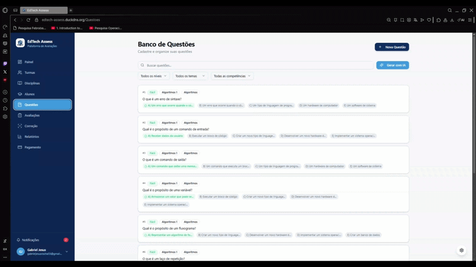
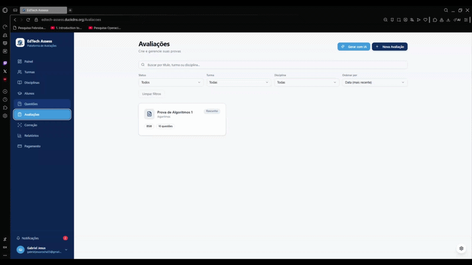

# EdTech Assess

Plataforma inteligente de avaliações educacionais com correção automática por OCR, geração de questões por IA e aplicativo mobile.

🌐 **Acesse:** https://edtech-assess.duckdns.org

---

## Tecnologias

| Camada | Stack |
|---|---|
| Frontend Web | React 18 + Vite + Tailwind CSS + shadcn/ui |
| Backend | Node.js + Express + PostgreSQL / pg-mem |
| Mobile | React Native + Expo SDK 54 |
| IA | Groq (llama-3.3-70b) + Tesseract.js (OCR) |
| Banco de dados | PostgreSQL (hospedado no AWS EC2) |
| Infra | AWS EC2 + Nginx + PM2 + Let's Encrypt |
| CI/CD | GitHub Actions |
| Testes | Jest + Supertest + Playwright |

---

## Funcionalidades

- Cadastro de turmas, alunos, disciplinas e questões
- Geração de avaliações com questões selecionadas
- **Correção automática por foto** (OCR + IA identifica respostas)
- Relatórios de desempenho individual e por turma (PDF, XLSX, CSV)
- Aplicativo mobile para professores (Android APK)
- Widget de acessibilidade (alto contraste, texto grande, leitura em voz alta)
- Notificações em tempo real
- HTTPS com certificado Let's Encrypt

---

## Como rodar localmente

### Pré-requisitos

- Node.js 20+
- npm

### Instalação

```bash
# Clone o repositório
git clone https://github.com/LeticiaBrito1/TCC-2026-EDTECH-ASSESS.git
cd TCC-2026-EDTECH-ASSESS

# Instale dependências do frontend
npm install

# Instale dependências do backend
npm install --prefix backend
```

### Executar

```bash
# Inicia backend (porta 8787) + frontend (porta 5174) juntos
npm start

# Ou separadamente:
npm run backend:dev   # só o backend
npm run dev           # só o frontend
```

O backend conecta ao PostgreSQL configurado em `DATABASE_URL`. Em desenvolvimento local, se não houver banco disponível, cai automaticamente para banco em memória (somente para testes).

---

## Testes

### Testes de integração (backend)

Cobrem autenticação e CRUD completo de todas as entidades. Rodam com banco em memória, sem dependência externa.

```bash
npm run test:backend
```

Resultado esperado:
```
Test Suites: 2 passed, 2 total
Tests:       25 passed, 25 total
Time:        ~4s
```

### Testes E2E (Playwright)

Requerem backend e frontend rodando localmente.

```bash
npm run backend:dev &
npm run dev &
npm run test:e2e
```

---

## Deploy

O deploy é feito automaticamente via **GitHub Actions** a cada push na branch `main`:

1. Faz o build do frontend (`vite build`)
2. Conecta no EC2 via SSH
3. Atualiza o backend (`npm ci` + `pm2 restart`)
4. Envia o `dist/` para `/var/www/edtech/dist`
5. Recarrega o Nginx

---

## Estrutura do projeto

```
├── src/                  # Frontend React
│   ├── pages/            # Páginas da aplicação
│   ├── components/       # Componentes reutilizáveis
│   ├── lib/              # Contextos e utilitários
│   └── api/              # Cliente HTTP (appClient)
├── backend/              # API Node.js/Express
│   ├── src/
│   │   ├── routes/       # Rotas da API
│   │   ├── controllers/  # Controladores
│   │   ├── services/     # Lógica de negócio
│   │   ├── models/       # Acesso ao banco
│   │   └── config/       # Configuração (DB, env)
│   └── tests/            # Testes Jest
├── mobile/               # App React Native (Expo)
├── tests/e2e/            # Testes Playwright
└── deploy/               # Configuração Nginx + scripts
```

---

## Variáveis de ambiente

Copie `backend/.env.test` como base para desenvolvimento local:

| Variável | Descrição |
|---|---|
| `DATABASE_URL` | URL de conexão com o PostgreSQL |
| `ALLOW_DB_FALLBACK` | `true` somente em desenvolvimento local, para usar banco em memória quando não houver PostgreSQL disponível |
| `JWT_SECRET` | Chave secreta para tokens JWT |
| `GROQ_API_KEY` | Chave da API Groq para geração de questões por IA |
| `ALLOW_DIRECT_LOGIN` | `true` apenas em testes automatizados (nunca em produção) |

---

## Tag de versão

```bash
git tag -a v1.0.0 -m "Versao 1.0.0 - Entrega TCC"
```

Commit base: `1d3ddbe15a6251064ab4de7c53cfc68ec80e93d9`


## Exemplos de Uso

A seguir, são apresentados alguns exemplos das principais telas e funcionalidades da plataforma **EdTech Assess**.

### Cadastro de usuário



Tela de cadastro onde o usuário pode criar uma conta para acessar as funcionalidades da plataforma.

---

### Login



Tela de login utilizada para autenticação do usuário e acesso ao sistema.

---

### Gerenciamento de turmas



Tela de turmas, onde é possível criar, editar e visualizar turmas, além de consultar os alunos vinculados a cada uma delas.

---

### Gerenciamento de disciplinas



Tela de disciplinas, onde o usuário pode cadastrar disciplinas e associá-las às turmas existentes.

---

### Gerenciamento de questões



Tela de questões, onde o usuário pode criar questões manualmente ou gerar questões com apoio de Inteligência Artificial.

---

### Criação de avaliações



Tela de avaliações, onde o usuário pode montar provas a partir das questões cadastradas, definir pontuações, criar versões diferentes da mesma avaliação com questões embaralhadas e utilizar recursos de geração com Inteligência Artificial.

---

## Como contribuir com o projeto

Contribuições, sugestões e feedbacks são bem-vindos.

Caso encontre algum problema, tenha uma sugestão de melhoria ou queira contribuir com novas funcionalidades para a plataforma, você pode entrar em contato pelo e-mail:

**leticiabritoferreiraa@gmail.com**

Também é possível contribuir seguindo o fluxo abaixo:

1. Faça um fork deste repositório.
2. Crie uma branch para sua alteração:

```bash
git checkout -b minha-melhoria
